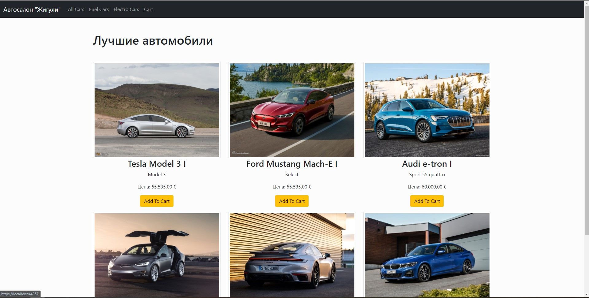
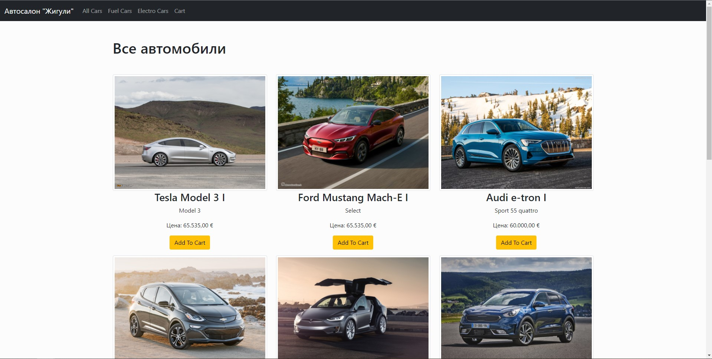
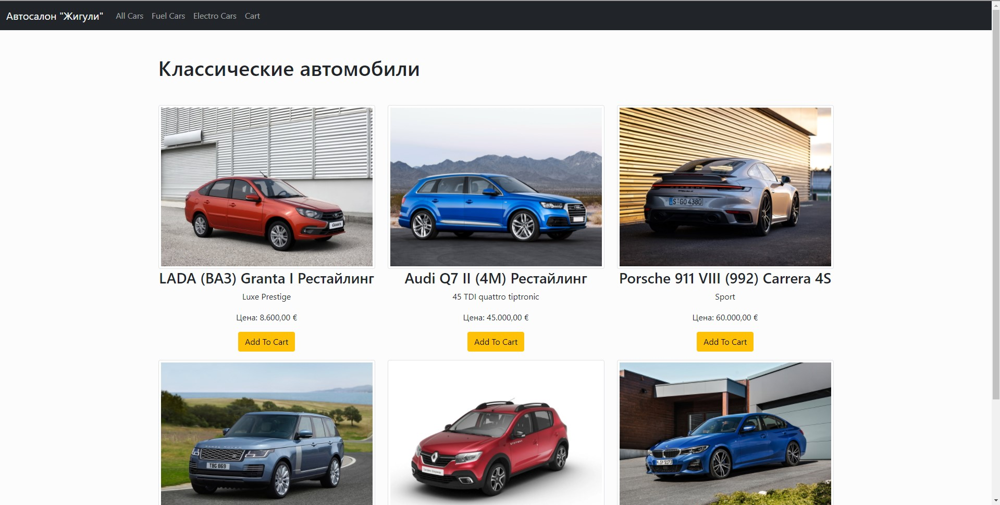
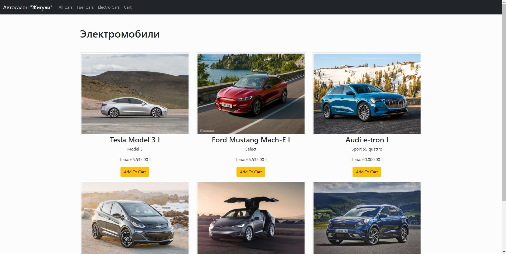
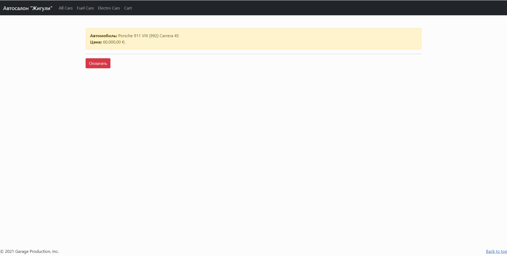
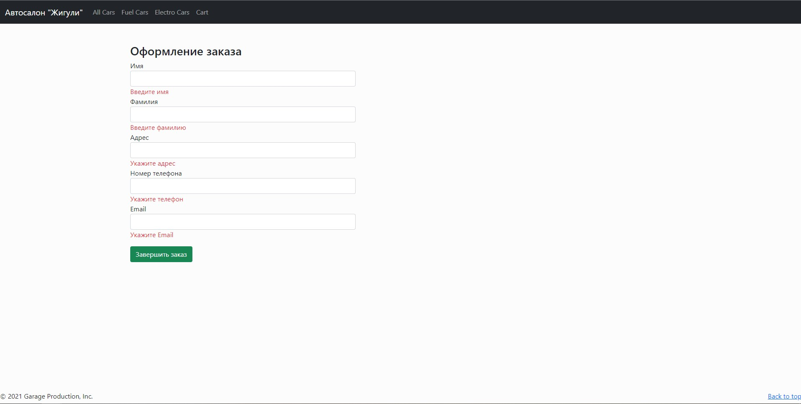
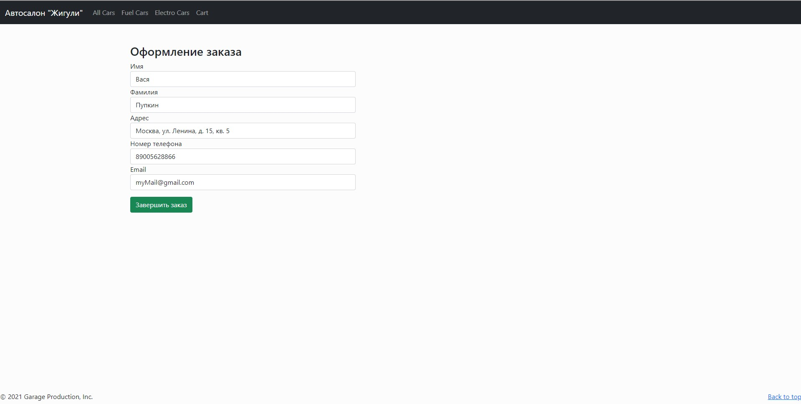
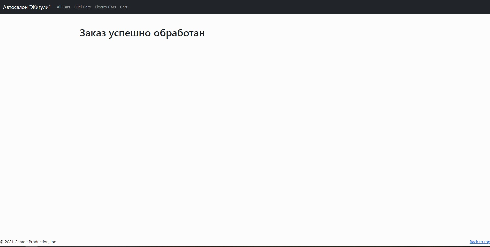

# CarShop
Данное веб приложение создано для учебных целей, направлено на изучение и работу со следующими технологиями: MVC, Entity Framework (Code-First), Bootstrap...

Приложение представляет собой интернет магазин автомобилей. Все автомобили загружаются из базы данных с помощью Entity Framework. Есть возможность добавить любой автомобиль, или несколько автомобилей в корзину с дальнейшим оформлением заказа.

Целевая платформа - .Net Core 2.1

## Описание работы приложения
При запуске приложения, на главной странице сайта вы увидите перечень "лучших" автомобилей (автомобили из БД, у которых поле `IsFavourite = true`)

Сверху на странице можно заметить навигационный раздел, откуда вы можете переместиться на вкладки со всеми имеющимися автомобилями в наличии:

или посмотреть автомобили с ДВС:

или же автомобили с электро двигателем:

Под каждым автомобилем есть кнопка "Add To Cart" - с помощью неё вы можете добавить любой автомобиль в корзину для дальнейшей покупки.

После добавления в корзину вас автоматически перенаправит на страницу корзины. Там вы можете оформить свой заказ, щёлкнув на кнопку "Оплатить", либо продолжить свои покупки далее, кликнув на любую из ссылок навигационного раздела сверху

После нажатия на кнопку "Оплатить", вас перенаправит на страницу оформления заказа. Она представляет собой форму с проверкой ввода полей. Если информация будет пропущена, или введена некорректно, то заявка не будет отправлена до исправления ваших недочётов:

Если введённая вами информация корректна и соответствует ожиданиям полей формы, то оформление заказа завершится, а вы будете перенаправлены на другую страницу

